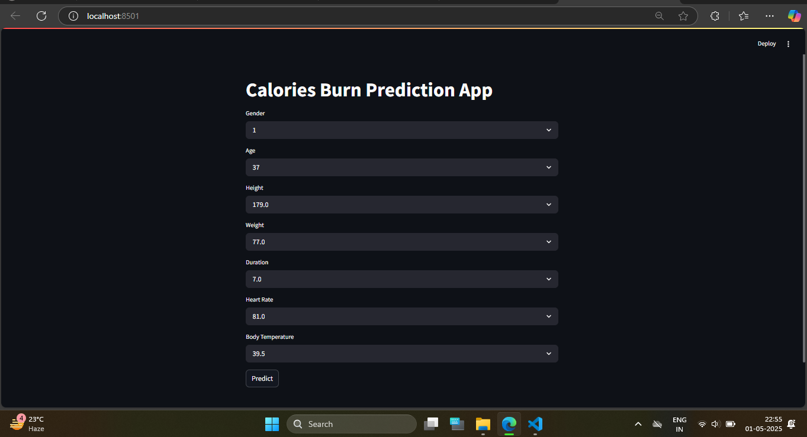

# calories_prediction

# 💪 Calories Prediction App

A machine learning-based Streamlit web app that predicts calories burned based on user inputs like age, height, weight, and workout stats. The app uses a regression model trained on a cleaned dataset from Kaggle.

## 📊 Features

- Cleaned and preprocessed dataset
- Trained regression model for calorie prediction
- Streamlit-based interactive user interface
- Real-time calorie output based on input parameters

## 📁 Dataset

- **Source**: Kaggle – Calories Burned Dataset
- **Features Used**: Age, Height, Weight, Duration, Heart Rate, Body Temperature
- **Target**: Calories

## 🧠 Model Info

- Model Type: Regression (e.g., Linear Regression, Random Forest)
- Evaluation: MAE, RMSE, R² Score

## 🛠 Tech Stack

- Python
- Pandas, NumPy
- Scikit-learn
- Streamlit
- Matplotlib / Seaborn

## 🖼️ App UI

Below is a preview of the Streamlit UI:

| App Interface |
|---------------|
|  |

## 🚀 How to Run the App Locally

```bash
git clone https://github.com/your-username/Calories_Prediction_App.git
cd Calories_Prediction_App
pip install -r requirements.txt
streamlit run app.py
